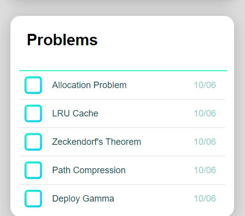

# PerfeQ
##### A PerfeQt tool to tackle false positives in problem solving and practice retrieval techniques.


[](https://travis-ci.org/joemccann/dillinger)

Oftentimes when we encounter a problem that we're unable to solve, 
and after taking help of hints and solution, we get a sense of feeling of completion and can move on.
But the same problem in another form, end up perturbing us in future.

PerfeQ was developed to tackle this issue of false-positive belief of grasp in the concept.
It let users submit such problems or concepts and presents them after a period of two weeks 
when the critical concepts are harder to recall from memory and challenges our problem-solving skills.


 available as chrome extension 

 works offline

 lightweight

 minimal

<p float="left">
  
  
</p>


### Installation

```sh
clone the repo
goto => chrome://extensions/
Enable Developer mode toggle
Click on Load unpacked and select the PerfeQ folder
```
