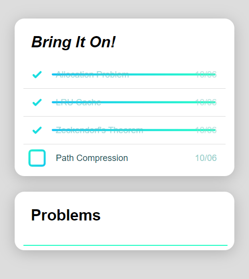

# PerfeQ
##### A PerfeQt tool to tackle false positives in problem solving and practice retrieval techniques.


[](https://travis-ci.org/joemccann/dillinger)

Often, individuals encounter problems they struggle to solve. Seeking help through hints and solutions can provide a sense of completion, allowing them to move forward. However, similar problems may resurface in different forms, causing further perturbation.

PerfeQ was developed to address this issue of false-positive belief in grasping concepts. It enables users to submit such problems or concepts, presenting them again after a two-week period. This timing ensures that critical concepts are harder to recall from memory, thereby challenging users' problem-solving skills and mitigating the risk of false confidence.


 available as chrome extension 

 works offline

 lightweight

 minimal

<p float="left">
  
  
</p>


### Installation

```sh
clone the repo
goto => chrome://extensions/
Enable Developer mode toggle
Click on Load unpacked and select the PerfeQ folder
```
